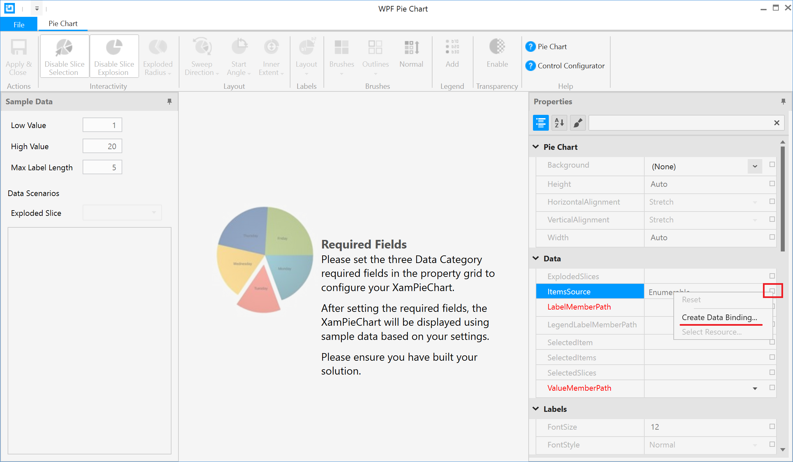
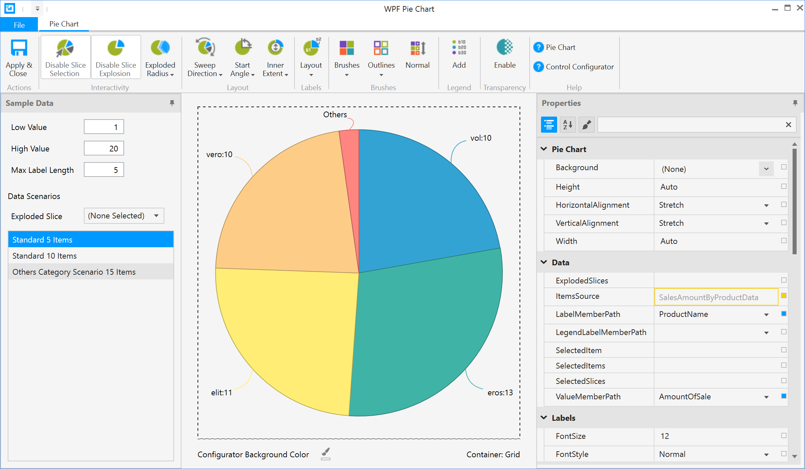

# PieChartの利用

年間の製品ごとの売上比率を表現するために XamPieChart を利用します。

## XamPieChart へバインドするデータソースの確認

DashboardViewModel.cs を開いて、ブレークポイントを設定してから実行し、SalesAmountByProduct の中にどんなデータが入っているのか見てみましょう。

| AmountOfSale | ProductName |
----|---- 
| 123 | みかん |
| 456 | ぶどう |
| ... | ... |

## XamPieChart の配置

Dashboard.xaml を開き、年間製品別売上比率のタイル内にXamPieChart を配置し、レイアウトをリセットします。

Dashboard.xaml

```xml
...
<ig:XamTile
    Header="年間製品別売上比率"
    ig:XamTileManager.Column="0"
    ig:XamTileManager.Row="0" 
    ig:XamTileManager.ColumnSpan="1"
    ig:XamTileManager.RowSpan="1">
    <ig:XamPieChart />
</ig:XamTile>
...
```

## Control Configulator で XamPieChart を設定

XamPieChartが定義されている行をクリックすると、左側に豆電球アイコンが表示されます。その豆電球をクリックするか、Ctrl + .キーを押して"構成 XamPieChart"メニューをさらに選択します。


Control configulator のダイアログが表示されます。



Control Configulator のダイアログ上で、まずはバインドするデータを選択します。プロパティウィンドウ上でItemsSourceプロパティを見つけて、"データバインドの作成"を選択します。


データバインディングのダイアログ上では、バインド可能なデータの一覧が表示されるます。ここでは、SalesAmountByProductDataを選択し、"バインディングの作成" を選択します。


Control configulator は選択したクラスのバインド可能なプロパティを自動検知し、LabelMemberPath と ValueMemberPath を自動的に設定してくれます。

XamPieChart のその他の設定を任意で行い、最後に「適用して閉じる」ボタンをクリックして設定を終了します。



## 結果確認

アプリケーションを実行し、結果を確認します。


## 備考
Control Configulatorを利用しなくても、XAML上でプロパティ設定を行っていくことは可能です。Control Configulatorは、チャートやグリッドなどプロパティ設定が豊富に用意されているコントロールを効率的にデザインするためのツールです。

XamPieChartについて、より詳細を知りたい方は以下のリンクよりヘルプトピックをご確認下さい。
[XamPieChart ヘルプ](https://jp.infragistics.com/help/wpf/piechart-getting-started-with-piechart)

## Next
[02-04 Configure BulletGraph](02-04-Configure-BulletGraph.md)
