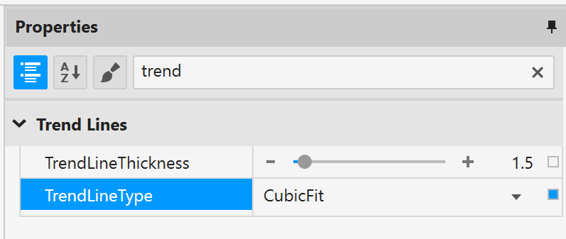
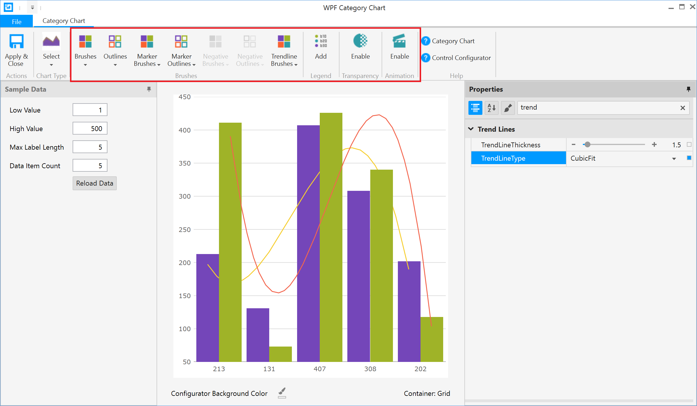

# CategoryChart の利用

月毎の売り上げ推移を表現するためにXamCategoryChartを利用します。

## XamPieChart へバインドするデータソースの確認

DashboardViewModel.cs を開いて、ブレークポイントを設定してから実行し、MonthlySalesAmount の中にどんなデータが入っているのか見てみましょう。

| Month | AmountOfSale |
----|---- 
| 1 | 123 |
| 2 | 456 |
| ... | ... |


## XamCategoryChart の配置

Dashboard.xaml を開き、月別売り上げのタイル内にXamPieChart を配置し、レイアウトをリセットします。

Dashboard.xaml

```xml
...
<ig:XamTile
    Header="月別売り上げ"
    ig:XamTileManager.Column="0"
    ig:XamTileManager.Row="1" 
    ig:XamTileManager.ColumnSpan="2"
    ig:XamTileManager.RowSpan="1" >
    <ig:XamCategoryChart />
</ig:XamTile>
...
```

## Control Configulator で XamCategoryChart を設定

XamCategoryChartが定義されている行をクリックすると、左側に豆電球アイコンが表示されます。その豆電球をクリックするか、Ctrl + .キーを押して"構成 XamBulletGraph"メニューをさらに選択します。Control Configulator のダイアログ上のプロパティウィンドウ上でItemsSourceプロパティを見つけて、"データバインドの作成"を選択します。


MonthlySalesAmount を選択し、"バインディングの作成"をクリックします。


チャートタイプよりデフォルトのカラムチャートを選択します。


トレンドラインを表示するために、TrendLineTypeプロパティでCubicFitを選択します。



XAxisInterval プロパティに1を設定し、すべての月がラベル表示されるようにします。


XamCategoryChart のその他の設定を任意で行い、最後に「適用して閉じる」ボタンをクリックして設定を終了します。



## 結果確認

アプリケーションを実行し、結果を確認します。


## 備考

XamCategoryChartは少ないコードで簡単にデータ視覚化を実現するための部品として提供されています。複数レイヤの表示や細かい軸の設定など、複雑なチャート表現を実現するためにはXamDataChartという別のチャートコントロールが提供されています。

[XamCategoryChart ヘルプ](https://jp.infragistics.com/help/wpf/categorychart-walkthrough)

[XamDataChart ヘルプ](https://jp.infragistics.com/help/wpf/datachart-getting-started-with-datachart)

## Next
[ピボット部品を利用したセルフBI画面の作成](../03-Create-Self-BI-UI-with-Pivot-controls/03-00-Overview-of-Section3.md)
